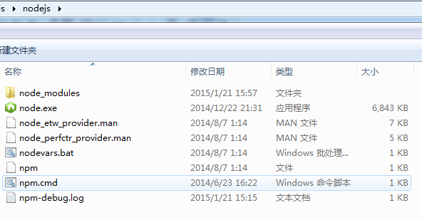

#NodeJS 初识

###Node简介
以下内容摘自[[百度百科](http://baike.baidu.com/link?url=dUVDqRGtE2J1UdLIfwIkxnV7vcNm_eku8ZF9JKBcyCWC5OBoA9E4_DxKR3HlBYD9D7GrOSuLnVaFJbMOzfPXxiK6dY4GlA6mle4HlvcyJRqDDXrs0KARha_pqsSC3whlvCIsu6ThUG4KwwXsyMQJeq "百度百科")]

>Node.js是一个基于Chrome JavaScript运行时建立的平台， 用于方便地搭建响应速度快、易于扩展的网络应用。Node.js 使用事件驱动， 非阻塞I/O 模型而得以轻量和高效，非常适合在分布式设备上运行的数据密集型的实时应用。

>V8引擎执行Javascript的速度非常快，性能非常好。Node对一些特殊用例进行了优化，提供了替代的API，使得V8在非浏览器环境下运行得更好。

>Node是一个Javascript运行环境(runtime)。实际上它是对Google V8引擎进行了封装。V8引 擎执行Javascript的速度非常快，性能非常好。Node对一些特殊用例进行了优化，提供了替代的API，使得V8在非浏览器环境下运行得更好。

###NodeJS安装
node.js的现在地址为：[https://nodejs.org/download/](https://nodejs.org/download/) ,由于使用的是win7旗舰版64位操作系统，所以选择下载的版本为：Windows Installer (.msi) 64位，所下载的版本可以根据自己操作系统来进行选择。

安装步骤，请参照[node.js windows版安装步骤](http://jingyan.baidu.com/article/a948d6515d4c850a2dcd2e18.html)
,安装完毕后，软件的目录下可以看到如下这些文件夹和文件：

至此，nodejs安装完毕。